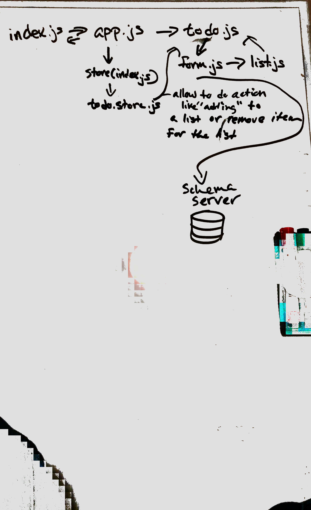

# LAB - 37

## Dynamic Forms

### Author: Liz Kavalski

### Links and Resources
* [submission PR](https://github.com/lizkavalski/lab-37/pull/1)-once being able to render the list onto the page I'll deploy it to another site.
* [Pratice Lab](https://codesandbox.io/s/lab-37-pratice-0p0uj)

### Modules
#### `todo.js`
Is a function that reviced infomation(items that needs to be done) from the 'form'

#### `todo-list.js`
Is a function the retrives infomation from the sever and renders onto the page.(still working on passing infomation from the form to make the list.)

#### `forms.js`
Renders a form using  "react-jsonschema-form" which createes a form using the schema that is stored in the sever. At this point it only add items, but does not render it on the page. 

### Setup
a .env is not require for this assignment.

#### Running the app
after cloning the git repo and downloading te dependices run:
* `npm start`
to view app.

  
#### Tests
at this poin t their is no test for this app.

#### UML

